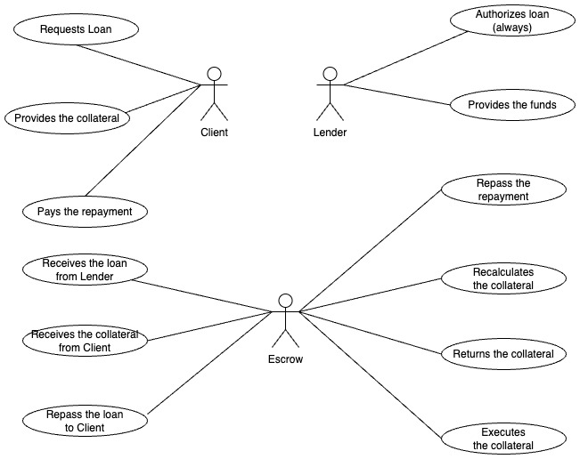

# Aurum Loan


## Overview
AurumLoan is a smart contract-based simulation demonstrating how tokenized gold can be used as collateral for loans in tokenized money (ERC-20). An escrow contract securely holds the gold until the loan is repaid, ensuring proper execution of the lending process.

## Features
- **Metamask Integration**: Users can connect their wallets to interact with the protocol.
- **Tokenized Gold as Collateral**: Users deposit tokenized gold into an escrow contract.
- **Loan Issuance**: Users receive tokenized money (ERC-20) equivalent to the loan amount.
- **Automated Repayment Flow**: Borrowers can repay loans before the due date to reclaim their collateral.
- **Collateral Execution**: If the borrower defaults, the collateral is transferred to the lender.

## How It Works
1. **User Requests a Loan**: The borrower locks tokenized gold in the escrow smart contract.
2. **Loan Disbursement**: The smart contract transfers tokenized money to the borrower.
3. **Repayment Flow**:
   - If repaid before the due date, the gold is returned to the borrower.
   - If the borrower defaults, the escrow contract transfers the gold to the lender.

## Out of Scope
To keep the project **simplified and focused on the core functionality**, the following aspects will **not** be included in the initial implementation:

- **Loan Interest Calculation**: The loan system will not include interest accrual mechanisms; loans will be issued and repaid at face value.
- **Lender Evaluation Process**: The lender will **always accept** the loan request without performing credit evaluations or risk assessments.

These exclusions allow for a **streamlined proof-of-concept** implementation while maintaining clarity in the loan lifecycle and smart contract interactions.

### Use case diagram



### Sequence diagram

### Class diagram

## Technology Stack
- **Smart Contracts**: Solidity, Hardhat
- **Blockchain Network**: Ethereum Testnet (Alchemy RPC)
- **Front-End**: React (with Wagmi, Ethers.js, RainbowKit)
- **Security**: OpenZeppelin libraries for secure smart contract development

## Smart Contracts
- `TokenizedGold.sol`: ERC-20 contract representing tokenized gold.
- `TokenizedMoney.sol`: ERC-20 contract representing the loan currency.
- `LoanEscrow.sol`: Handles the collateralization, loan issuance, repayment, and liquidation.

```
│── /backend
│   ├── /contracts      # Solidity smart contracts
│   ├── /scripts        # Deployment scripts
│   ├── /test           # Smart contract tests
│   ├── Dockerfile      # Dockerfile for backend
│── /frontend
│   ├── /src
│   │   ├── /components # React UI components
│   │   ├── /pages      # Loan request, repayment UI
│   │   ├── /hooks      # Blockchain interactions
│   │   ├── Dockerfile  # Dockerfile for frontend     
│── /deployments        # Deployed contract addresses
│── .env                # Environment variables
│── README.md           # Project documentation
│── docker-compose.yml  # Docker Compose file
```

## Deployment & Testing

### Clone the Repository
```sh
git clone https://github.com/yourusername/AurumLoan.git
cd AurumLoan
```

### Build and Start Docker Containers
```sh
docker-compose up --build
```
This will:
- Start a **Hardhat Node** for local blockchain testing (**port 8545**).
- Deploy **TokenizedGold, TokenizedMoney, and LoanEscrow** contracts.
- Start the **React frontend** for interaction (**port 3000**).

> 💡 **Note:** Contract addresses will be displayed in the terminal upon deployment.

### Run Loan Use Case (Requesting a Loan)
Once contracts are deployed, simulate the loan lifecycle using the **pre-built Hardhat script** inside the running container:
```sh
docker exec -it aurumloan_backend npx hardhat run scripts/useCase.js --network localhost
```
This script will:
- Mint **TokenizedGold (tGOLD) and TokenizedMoney (tMONEY)**.
- Transfer **tGOLD to the client** and **tMONEY to the lender**.
- The **client requests a loan**, locking tGOLD in escrow.
- Check balances to confirm transactions.

### Run Loan Repayment Test (Optional)
To simulate **loan repayment**, run:
```sh
docker exec -it aurumloan_backend npx hardhat run scripts/repayLoan.js --network localhost
```
This script will:
- Repay the loan using **tMONEY**.
- Unlock **tGOLD** and return it to the client.
- Check balances to confirm repayment.

### Stop and Clean Up
To stop the containers:
```sh
docker-compose down
```
This **removes** all running containers but **keeps contract data**.

To remove **everything** (including contract states):
```sh
docker-compose down -v
```


## License
This project is licensed under the [MIT License](./LICENSE)